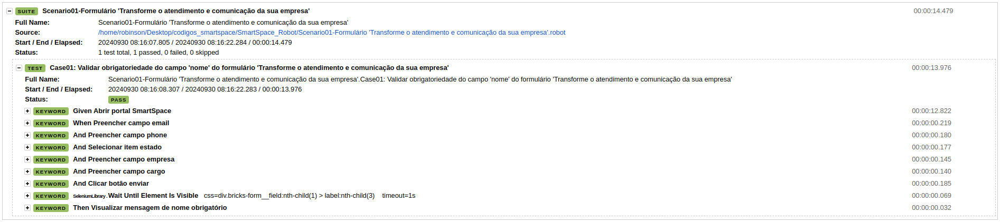

# Estruturas
## Arquivos

- **.vscode** -> Pasta contendo configurações de ambiente do Visual Studio Code
    - `settings.json` -> Arquivo de configurações de ambiente do Visual Studio Code    
- `demo.png` -> Arquivo de demonstração de execução de um teste com robot
- `output.xml` -> Arquivo contendo os passos da implementação dos testes em forma de árvore
- `report.html` -> Arquivo contendo a visão geral dos testes executados
- `Scenario01-Formulário 'Transforme o atendimento e comunicação da sua empresa'.robot` -> Arquivo contendo configurações, variáveis, palavras-chave e case de teste
- `readme.md` -> Arquivo com sintaxe [m]ark[d]own

# Executar Cucumber
## Clonar o projeto
`https://github.com/robinsonmourao/SmartSpace_Robot.git`
## Abrir o terminal e acessar a pasta raíz do projeto
`cd <path-do-projeto>/SmartSpace_Robot`
## Instalar bibilioteca SeleniumLibrary
`pip install robotframework-seleniumlibrary`
## Instalar bibilioteca FakerLibrary
`pip install robotframework-faker`

## Executar o projeto
`robot "Scenario01-Formulário 'Transforme o atendimento e comunicação da sua empresa'.robot"`
OU Instalar extensão para vscode via marketplace: 
`robocorp.robotframework-lsp`

# Fotos do projeto em execução

# Status de desenvolvimento

| Tarefa             | Status        |
|--------------------|---------------|
| Desenvolvimento de plano de ação    | CONCLUÍDO |
| Implementação                       | CONCLUÍDO |